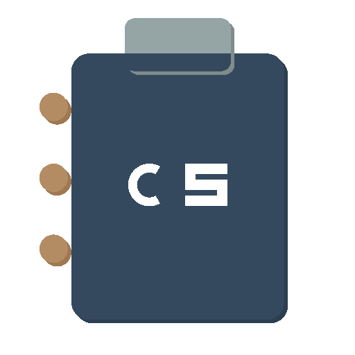

# 📋 LocalClip

<div align="center">



**A modern, Windows 11-inspired clipboard manager with local storage and privacy-first design**

[](https://opensource.org/licenses/MIT)
[](https://nodejs.org/)
[](https://electronjs.org/)
[](https://reactjs.org/)
[](https://www.typescriptlang.org/)

[Features](#-features) • [Installation](#-installation) • [Usage](#-usage) • [Development](#-development) • [Contributing](#-contributing)

</div>

## 🌟 Features

### 📋 **Smart Clipboard Management**

- **Real-time monitoring** of system clipboard with persistent history
- **Multi-format support**: Text, Images, Files, HTML, RTF
- **Intelligent categorization** with auto-detection
- **Duplicate detection** and smart merging
- **Pin important items** for quick access

### 🔍 **Powerful Search & Filter**

- **Instant search** with fuzzy matching
- **Content type filtering** (Text, Images, Files, URLs, Code)
- **Date range filters** (Today, Week, Month, Custom)
- **Source application filtering**
- **Advanced search** with regex support

### 🎨 **Modern Windows 11-Inspired UI**

- **Fluent Design** with acrylic blur effects
- **Dynamic theming** (Light, Dark, Auto)
- **Responsive grid layout** (2-6 columns)
- **Smooth animations** and transitions
- **Accessibility compliant** (WCAG 2.1 AA)

### ⚡ **System Integration**

- **Global hotkeys** for quick access (`Ctrl/Cmd + Shift + V`)
- **System tray integration** with context menu
- **Auto-start on system boot** (optional)
- **Cross-platform support** (Windows, macOS, Linux)

### 🔒 **Privacy & Security**

- **Local storage only** - no cloud sync
- **Excluded apps** configuration
- **Incognito mode** for sensitive operations
- **Auto-cleanup** with configurable retention
- **Optional data encryption**

### 📊 **Advanced Features**

- **Usage analytics** and statistics
- **Export/Import** clipboard history
- **Bulk operations** (delete, categorize)
- **Keyboard shortcuts** for power users
- **Plugin system** for extensibility

## 🚀 Installation

### Download Pre-built Binaries

Visit our [Releases page](https://github.com/ahadalichowdhury/LocalClip/releases) to download the latest version:

- **Windows**: `LocalClip-Setup-1.0.0.exe` or `LocalClip-1.0.0-portable.exe`
- **macOS**: `LocalClip-1.0.0.dmg` or `LocalClip-1.0.0-mac.zip`
- **Linux**: `LocalClip-1.0.0.AppImage` or `LocalClip-1.0.0.deb`

### Build from Source

```bash
# Clone the repository
git clone https://github.com/ahadalichowdhury/LocalClip.git
cd LocalClip

# Install dependencies
npm install

# Development mode
npm run dev

# Build for production
npm run build

# Package for your platform
npm run package
```

## 🎯 Usage

### Quick Start

1. **Launch LocalClip** from your applications menu
2. **Copy anything** to your clipboard - it's automatically saved
3. **Press `Ctrl/Cmd + Shift + V`** to open the clipboard manager
4. **Click any item** to paste it instantly
5. **Pin important items** using the pin icon
6. **Search and filter** to find what you need quickly

### Keyboard Shortcuts

| Shortcut               | Action                     |
| ---------------------- | -------------------------- |
| `Ctrl/Cmd + Shift + V` | Show/Hide LocalClip window |
| `Ctrl/Cmd + Shift + C` | Clear clipboard history    |
| `Ctrl/Cmd + Shift + P` | Pin current clipboard item |
| `Escape`               | Hide window                |
| `Enter`                | Paste selected item        |
| `Delete`               | Remove selected item       |
| `Ctrl/Cmd + F`         | Focus search box           |
| `↑/↓`                  | Navigate items             |

### Configuration

Access settings through:

- **System tray** → Right-click → Settings
- **Main window** → Settings icon (⚙️)
- **Keyboard** → `Ctrl/Cmd + ,`

#### Key Settings

- **Max History Items**: 40-1000 entries (default: 40)
- **Global Hotkey**: Customize the main shortcut
- **Auto-start**: Launch on system startup
- **Theme**: Light, Dark, or Auto
- **Excluded Apps**: Prevent monitoring specific applications
- **Auto-cleanup**: Automatically remove old entries

## 🛠️ Development

### Prerequisites

- **Node.js** ≥ 18.0.0
- **npm** ≥ 8.0.0
- **Git**

### Project Structure

```
LocalClip/
├── src/
│   ├── main/           # Electron main process
│   ├── renderer/       # React frontend
│   ├── preload/        # Preload scripts
│   └── shared/         # Shared types and utilities
├── assets/             # Icons and resources
├── docs/               # Documentation
├── tests/              # Test files
└── scripts/            # Build and utility scripts
```

### Development Commands

```bash
# Start development server
npm run dev

# Run tests
npm test
npm run test:watch
npm run test:coverage

# Linting and formatting
npm run lint
npm run lint:fix
npm run format

# Type checking
npm run typecheck

# Build for production
npm run build

# Package applications
npm run package:win     # Windows
npm run package:mac     # macOS
npm run package:linux   # Linux
```

### Tech Stack

- **Frontend**: React 18, TypeScript, Tailwind CSS
- **Backend**: Electron 36, Node.js
- **State Management**: Zustand
- **Testing**: Jest, React Testing Library
- **Build**: Electron Vite, Electron Builder
- **UI Components**: Lucide React, Framer Motion

### Architecture

LocalClip follows a clean architecture pattern:

```
┌─────────────────┐    ┌─────────────────┐    ┌─────────────────┐
│   Renderer      │    │   Main Process  │    │   System APIs   │
│   (React UI)    │◄──►│   (Electron)    │◄──►│   (Clipboard)   │
└─────────────────┘    └─────────────────┘    └─────────────────┘
         ▲                       ▲
         │                       │
         ▼                       ▼
┌─────────────────┐    ┌─────────────────┐
│   State Store   │    │   Data Layer    │
│   (Zustand)     │    │   (SQLite)      │
└─────────────────┘    └─────────────────┘
```

## 📚 Documentation

- **[Setup Guide](docs/SETUP.md)** - Detailed installation and configuration
- **[Development Guide](docs/DEVELOPMENT.md)** - Contributing and development setup
- **[API Documentation](docs/API.md)** - Internal API reference
- **[Feature Specifications](docs/FEATURES.md)** - Detailed feature documentation

## 🔨 Build Guides

- **[📖 Complete Build Guide](docs/BUILD_GUIDE.md)** - Step-by-step instructions for all platforms
- **[⚡ Quick Build Reference](docs/QUICK_BUILD_REFERENCE.md)** - Copy-paste commands for quick builds
- **[✅ Release Checklist](docs/RELEASE_CHECKLIST.md)** - Pre-release testing and distribution checklist

### Platform-Specific Guides

- **[🪟 Windows FREE Build](README_FREE_BUILD.md)** - Build Windows .exe without certificates
- **[🐧 Linux Distribution](docs/LINUX_FREE_GUIDE.md)** - FREE Linux distribution options
- **[🆓 FREE Code Signing](docs/FREE_SIGNING.md)** - Alternatives to expensive certificates

### Quick Build Commands

```bash
# Build for all platforms (no signing)
npm run dist:unsigned

# Windows with self-signed certificate (FREE)
powershell -ExecutionPolicy Bypass -File scripts/create-self-signed-cert.ps1
npm run dist:win

# Linux store setup (FREE)
npm run setup:snap      # Snap Store
npm run setup:flatpak   # Flathub

# macOS
npm run dist:mac        # Current architecture
npm run dist:mac:universal  # Universal binary
```

## 🤝 Contributing

We welcome contributions! Please see our [Contributing Guide](CONTRIBUTING.md) for details.

### Quick Contribution Steps

1. **Fork** the repository
2. **Create** a feature branch (`git checkout -b feature/amazing-feature`)
3. **Commit** your changes (`git commit -m 'Add amazing feature'`)
4. **Push** to the branch (`git push origin feature/amazing-feature`)
5. **Open** a Pull Request

### Development Setup

```bash
# Fork and clone your fork
git clone https://github.com/YOUR_USERNAME/LocalClip.git
cd LocalClip

# Add upstream remote
git remote add upstream https://github.com/ahadalichowdhury/LocalClip.git

# Install dependencies
npm install

# Start development
npm run dev
```

## 📄 License

This project is licensed under the MIT License - see the [LICENSE](LICENSE) file for details.

## 👨‍💻 Author

**S. M. Ahad Ali Chowdhury**

- Email: smahadalichowdhury@gmail.com
- GitHub: [@ahadalichowdhury](https://github.com/ahadalichowdhury)

## 🙏 Acknowledgments

- **Electron.js** team for the amazing framework
- **React** team for the powerful UI library
- **Windows 11** design team for inspiration
- **Open source community** for various libraries and tools

## 📊 Project Stats


---

<div align="center">

**⭐ Star this repository if you find it helpful!**

[Report Bug](https://github.com/ahadalichowdhury/LocalClip/issues) • [Request Feature](https://github.com/ahadalichowdhury/LocalClip/issues) • [Discussions](https://github.com/ahadalichowdhury/LocalClip/discussions)

</div>
